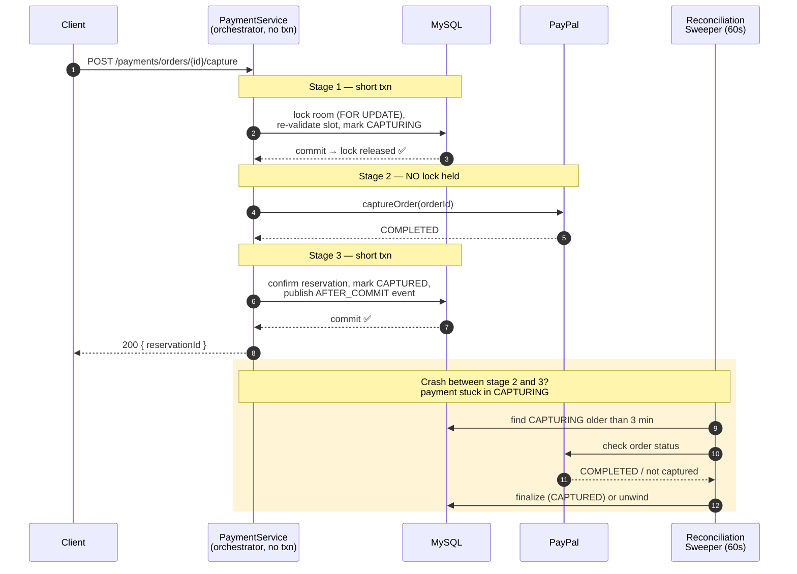

# AirDnD

An Airbnb-style booking platform — full-stack, cloud-deployed, and built around three hard backend problems: **geo search at scale**, **lock-free payment capture**, and **double-booking prevention under concurrency**.

**Stack:** Spring Boot 3.5 · Java 21 · MySQL 8.4 · QueryDSL · Spring Security (OAuth2/OIDC) · React 19 · AWS (CloudFront, EC2, S3, Route53, SSM) · Terraform · Prometheus/Grafana · k6

> Monorepo built by a team of 2 as part of the CodeSquad Masters backend program.

---

## Contents

- [Architecture](#architecture)
- [Repository layout](#repository-layout)
- [Engineering highlights](#engineering-highlights)
  - [1. Spatial (R-tree) map search on 1.1M listings](#1-spatial-r-tree-map-search-on-11m-listings)
  - [2. Lock-free payment capture](#2-lock-free-payment-capture)
  - [3. Double-booking prevention](#3-double-booking-prevention)
  - [4. Real-time notifications via domain events](#4-real-time-notifications-via-domain-events)
  - [5. Auth & security](#5-auth--security)
- [Backend modules](#backend-modules)
- [Infrastructure & deployment](#infrastructure--deployment)
- [Observability & load testing](#observability--load-testing)
- [Running locally](#running-locally)

---

## Architecture

Two-box AWS topology so the app and database never contend for the same CPU/memory, with CloudFront terminating SSL at the edge and a private management plane for metrics.

```
                    ┌──────────────┐
   Browser ──────►  │  CloudFront  │  (SSL termination, edge firewalling)
                    └──────┬───────┘
              ┌────────────┴────────────┐
              ▼                         ▼
     ┌─────────────────┐        ┌────────────────┐
     │  S3 (static SPA)│        │ airdnd-backend │  app :8080
     └─────────────────┘        │  Spring Boot   │  actuator :8081 (private)
                                └───────┬────────┘
                                        │ private network only
                                        ▼
                                ┌────────────────┐
                                │  airdnd-mysql  │  :3306 (app-SG only)
                                └────────────────┘
```

- **Backend:** Spring Boot 3.5, Java 21, Spring Data JPA + QueryDSL 5.1, Spring Security (OAuth2/OIDC), Flyway migrations, Hibernate Spatial, AWS S3 SDK, Micrometer/Prometheus actuator.
- **Frontend:** React 19, Vite 8, TypeScript, React Router 7, TanStack Query, react-hook-form + Zod, Google Maps (`@vis.gl/react-google-maps` + marker clusterer), PayPal SDK, MSW for mocking.
- **Data:** MySQL 8.4 in production (H2 for fast local tests), all schema managed via Flyway (`V1`–`V11`).

---

## Repository layout

```
apps/
  backend/          Spring Boot 3 API server
  frontend/         React + Vite SPA
infra/
  aws/terraform/    IaC — CloudFront, EC2, S3, Route53, ACM, ECR, SSM, GitHub OIDC
  docker/ nginx/    container + reverse-proxy assets
monitoring/         Prometheus + Grafana + exporters (private, SSM-tunneled)
loadtest/           k6 scripts (listings / rooms / rooms-korea)
docs/               API specs, ADRs, ERD, architecture notes
.github/workflows/  CI/CD (backend → ECR/SSM, frontend → S3/CloudFront)
```

---

## Engineering highlights

### 1. Spatial (R-tree) map search on 1.1M listings

The map view queries listings inside a bounding box. A composite `(lat, lng, price)` B-tree index degraded to **full table scans** on wide boxes — a non-selective 2D range over ~1M rows (~2s per query).

**Fix:** migrate to a MySQL **spatial (R-tree) index** for the 2D range, plus cursor pagination to bound cost.

- A generated `location POINT ... SRID 0` column carries a `SPATIAL INDEX` (`V9` → `V10`).
  MySQL's optimizer only uses a spatial index when the column is **SRID-restricted** — a plain `POINT` (even if every value is SRID 0) is silently ignored and the query full-scans. `V10` rebuilds the column with an explicit `SRID 0` attribute to make the index usable.
- The predicate emits a **bare `MBRContains(...)`** boolean template rather than `MBRContains(...) = 1`, because wrapping it in `= 1` hides the spatial predicate from the optimizer and forces a full scan.
- **Cursor pagination** (`room.id > cursorId`, fetch `size + 1`) bounds query cost instead of `OFFSET`.
- `countInArea` **caps the count at 1000** (rendered as "1000+") instead of an exact `COUNT(*)`, since an exact count over a dense box is itself a full scan — cursor pagination doesn't need the true total.

Verified with `EXPLAIN ANALYZE` and k6 load tests (see [`loadtest/`](loadtest)).

*Code: [`RoomPredicates.withinBounds`](apps/backend/src/main/java/com/airdnd/room/RoomPredicates.java), [`RoomQueryRepositoryImpl`](apps/backend/src/main/java/com/airdnd/room/RoomQueryRepositoryImpl.java), migrations [`V9`](apps/backend/src/main/resources/db/migration/V9__add_rooms_spatial.sql)/[`V10`](apps/backend/src/main/resources/db/migration/V10__rooms_location_srid.sql).*

### 2. Lock-free payment capture

Naively, capturing a PayPal payment holds the reservation's DB lock across the external PayPal API call — a network round-trip inside a transaction that caused **lock-timeout cascades** under load.

**Fix:** decompose capture into three short transactions and **never hold a DB lock across the external call**. The orchestrator itself is *not* transactional:

1. **Stage 1 (short txn):** pessimistic-lock the room, re-validate the slot, mark the payment `CAPTURING` → lock releases on commit. The 15-minute `PENDING` hold already reserves the slot, so no lock is needed during the external call.
2. **Stage 2 (no lock):** call PayPal `captureOrder` — the room is free for other requests the whole time.
3. **Stage 3 (short txn):** confirm the reservation, mark `CAPTURED`, publish an `AFTER_COMMIT` domain event.

If the process dies mid-capture, the payment is left in `CAPTURING` and a **reconciliation sweeper** (every 60s, threshold 3 min) checks PayPal and finalizes or unwinds it — eventual consistency without holding locks.



*Code: [`PaymentService.capture`](apps/backend/src/main/java/com/airdnd/payment/PaymentService.java), [`PaymentReconciliationSweeper`](apps/backend/src/main/java/com/airdnd/payment/PaymentReconciliationSweeper.java), [`ReservationService.lockAndPrepareForCapture`](apps/backend/src/main/java/com/airdnd/reservation/ReservationService.java).*

### 3. Double-booking prevention

- A DB **overlap index** on `(room_id, check_out_date, check_in_date)` ([`V2`](apps/backend/src/main/resources/db/migration/V2__add_reservation_overlap_index.sql)) backs an `existsOverlappingReservation` check.
- Booking creates a **15-minute `PENDING` hold**; both `PENDING` and `CONFIRMED` count as blocking, so a hold reserves the slot before payment.
- An **expiration sweeper** (every 60s) bulk-cancels unpaid expired holds, releasing the slot.
- Just before capture, the slot is re-validated under a room lock and the hold is re-acquired if it lapsed but the room is still free — preventing charges for a slot that was taken in the meantime.

### 4. Real-time notifications via domain events

Notifications (new reservation, cancellation, new review) are delivered over **Server-Sent Events**, driven by `@TransactionalEventListener(AFTER_COMMIT)` + `@Async`:

- Events fire only **after** the originating transaction commits, so notifications never reference uncommitted state.
- SSE delivery happens **outside** the transaction, so a slow client can't pin a DB connection.
- Notification persistence failures are isolated and logged — they never break the originating request.

*Code: [`NotificationEventListener`](apps/backend/src/main/java/com/airdnd/notification/NotificationEventListener.java), [`NotificationService`](apps/backend/src/main/java/com/airdnd/notification/NotificationService.java).*

### 5. Auth & security

- **Google OAuth2 / OIDC** login via a custom `OidcUserService` that finds-or-creates a member and maps it to an `AuthMemberPrincipal`.
- **Session-based** security with a delegating `SecurityContextRepository`.
- **Role-based** authorization (`GUEST` / `HOST` / `ADMIN`) — e.g. `/api/host/**` requires `HOST` or `ADMIN`.
- **Two filter chains:** the actuator chain (`:8081`) is permit-all but the port is private; the main chain guards `/api/**` and returns `401` (not a redirect) for unauthenticated API calls.

*Code: [`SecurityConfig`](apps/backend/src/main/java/com/airdnd/config/SecurityConfig.java), [`OAuthService`](apps/backend/src/main/java/com/airdnd/auth/OAuthService.java).*

---

## Backend modules

| Module | Responsibility | Notable pieces |
|---|---|---|
| `room` | Listing search, detail, host CRUD, image upload | QueryDSL spatial search, S3 presigned URLs, cursor pagination |
| `reservation` | Hold-based booking, guest/host views, availability | Overlap check, hold expiry sweeper, per-tab cursors |
| `payment` | PayPal order + capture, reconciliation | Lock-free 3-stage capture, stuck-capture sweeper |
| `notification` | Real-time SSE notifications | AFTER_COMMIT async event listeners, emitter registry |
| `auth` / `user` | OAuth2 login, sessions, roles, host activation | OIDC user service, role escalation |
| `review` | Post-stay reviews (one per reservation) | Rating aggregation via QueryDSL |
| `wishlist` | Named wishlists, saved-room toggles | Batched room-card projections |
| `common` / `config` | Error handling, security, async, spatial-fn registration | `GlobalBusinessExceptionHandler`, `ErrorCode` |

### Key REST endpoints

```
GET    /api/rooms                         search listings (geo/region/price/capacity + cursor)
GET    /api/rooms/{roomId}                listing detail
GET    /api/rooms/{roomId}/reviews        reviews for a listing
POST   /api/reservations                  create a hold
GET    /api/reservations                  guest reservations (upcoming/past/cancelled tabs)
DELETE /api/reservations/{id}             cancel
POST   /api/payments/orders               create PayPal order
POST   /api/payments/orders/{id}/capture  capture payment
POST   /api/host/rooms                    host: create listing
GET    /api/host/rooms/{id}/reservations  host: reservations for a room
POST   /api/host/rooms/images/presign     S3 presigned upload URL
GET    /api/notifications/stream          SSE notification stream
GET    /api/auth/me                       current user
```

---

## Infrastructure & deployment

- **Terraform** (`infra/aws/terraform/`) provisions the full topology: CloudFront + ACM, Route53 DNS, two EC2 instances, S3 (static site + uploads), ECR, SSM parameters, and GitHub OIDC IAM roles.
- **Backend CI/CD** ([`backend-deploy.yml`](.github/workflows/backend-deploy.yml)): Gradle build → Docker image → push to ECR → deploy over SSM (the repo is never checked out on the box).
- **Frontend CI/CD** ([`frontend-deploy.yml`](.github/workflows/frontend-deploy.yml)): Vite build → `aws s3 sync` → CloudFront invalidation.

---

## Observability & load testing

- **Metrics** (`monitoring/`): Prometheus + Grafana + `mysqld-exporter` + `node-exporter` + cAdvisor, tracking three latency layers — app/HikariCP pool, MySQL, and machine. Everything stays private (Grafana on loopback, reached via SSM tunnel; actuator port off the public security group).
- **Load testing** (`loadtest/`): k6 scripts that drove the search-index work above and reproduced an **OOM crash at ~50 req/s** during a full-table write, validating capacity limits before tuning.
- **Tests:** JUnit 5 + Testcontainers (MySQL) + Mockito, including concurrency, lock-contention, capture-revalidation, and hold-expiry integration tests.

---

## Running locally

```bash
# 1. Start MySQL
docker compose up -d

# 2. Backend (defaults to the `local` profile, H2/MySQL)
cd apps/backend
./gradlew bootRun          # app on :8080, actuator on :8081

# 3. Frontend
cd apps/frontend
npm install
npm run dev                # Vite dev server on :5173
```

Flyway applies all migrations on startup. OAuth, PayPal, and Google Maps require the corresponding client IDs/secrets as environment variables (see `apps/backend/src/main/resources/application.yml` and the frontend `.env`).
